#  R2.02 - Développement d'applications avec IHM

### IUT d'Aix-Marseille - Département Informatique Aix-en-Provence

* **Ressource:** [R2.02](https://cache.media.education.gouv.fr/file/SP4-MESRI-26-5-2022/14/6/spe617_annexe15_1426146.pdf)

* **Responsables:**

  * [Sébastien Nedjar](mailto:sebastien.nedjar@univ-amu.fr)

* **Enseignants :**

  * [Frédéric Flouvat](mailto:frederic.flouvat@univ-amu.fr)
  * [Sophie Nabitz](mailto:sophie.nabitz@univ-avignon.fr)
  * [Samir Chtioui](mailto:samir.chtioui@gmail.com)


* **Besoin d'aide ?**
    * Consulter et/ou créer des [issues](https://github.com/IUTInfoAix-R202/tp1/issues)
    * [Email](mailto:sebastien.nedjar@univ-amu.fr) pour toute question


## TP1 - Bases JavaFX

## Objectifs de la séance

### Ce que vous saurez faire à la fin de cette séance

Les exercices de ce TP sont organisés en progression : chaque exercice vous fait monter d'un cran dans la maîtrise de JavaFX. Cette progression suit la **taxonomie de Bloom**, un modèle pédagogique qui décrit les niveaux de maîtrise d'un savoir-faire - du plus simple (comprendre un concept) au plus complexe (créer une application complète).

| Niveau Bloom | Exercices | Vous serez capable de... | Compétence BUT |
|---|---|---|---|
| **Comprendre** | 1-2 | Expliquer le rôle de `Application`, `Stage` et du cycle de lancement JavaFX. Personnaliser une fenêtre (titre, dimensions, style). | AC11.02 |
| **Appliquer** | 3-4 | Construire une interface graphique en combinant conteneurs (`BorderPane`, `GridPane`, `HBox`) et composants (`Label`, `TextField`, `MenuBar`). | AC11.04 |
| **Analyser / Créer** | 5-6 | Concevoir une application interactive complète avec écouteurs d'événements, compteurs indépendants et feedback visuel. | AC11.04 |

**Tout au long du TP**, vous pratiquez aussi le **workflow professionnel** (GitHub Classroom, Codespace, Maven, branche → Pull Request → review). Ces compétences sont formellement développées et évaluées en **R2.03 (Qualité de développement)**, module couplé à R2.02 par la SAÉ 2.01 commune.

### Pourquoi cette démarche ?

Ce TP utilise le **TDD (Test-Driven Development) en baby steps** : les tests sont livrés désactivés (`@Disabled`) et vous les activez un par un, comme un cahier des charges dont on implémente les exigences une à une. Ce n'est pas un artifice pédagogique : c'est une **méthode de développement professionnel** (formalisée par Kent Beck dans l'Extreme Programming) utilisée dans l'industrie logicielle.

Le workflow Git que vous pratiquerez - créer une branche par exercice, pousser, ouvrir une Pull Request, recevoir une review automatique de Copilot, puis merger - reproduit le **cycle de travail en entreprise**. L'objectif est d'apprendre à collaborer avec des outils, pas seulement à écrire du code.

Copilot Chat est configuré dans ce projet comme un **tuteur** : il ne donnera pas la solution d'emblée. Il commence par expliquer le concept, puis oriente vers la documentation, et ne propose du code qu'en dernier recours. L'objectif est que vous compreniez chaque ligne de code que vous écrivez.

### Lien avec la SAE 2.01

La SAE 2.01 vous demandera de **créer une interface d'extraction et manipulation de données** pour des capteurs permettant de **détecter et identifier les chauve-souris** à partir de leurs émissions ultrasonores.

Pour construire cette interface, vous aurez besoin de compétences acquises progressivement dans les TP du module R2.02 :

- **TP1** (celui-ci) : fenêtres, scènes, composants de base et événements, les **fondations**
- **TP2** : properties et bindings, la **liaison de données** entre l'interface et le modèle
- **TP3** : FXML, la **conception déclarative** d'interfaces complexes
- **TP4** : architecture MVVM, la **séparation des responsabilités** entre vue et logique
- **TP5** : persistance, la **lecture et écriture de données** (fichiers, bases de données)

Ce TP1 pose les premières briques : créer une fenêtre, organiser des composants dans un layout, et réagir aux actions de l'utilisateur. Ces compétences seront vos outils quotidiens jusqu'à la SAE.

### Prérequis

#### Connaissances attendues

- **Bases de la programmation** : variables, types, structures de contrôle, tableaux (acquis en C++ dans la ressource R1.01)
- **Programmation orientée objet en Java** : classes, objets, héritage, interfaces, polymorphisme (acquis dans la ressource R2.01)
- **Git** : les concepts (dépôt, commit, branche) ont été vus en cours, mais pas encore réellement pratiqués. Un TP dédié en R2.03 est prévu en parallèle. Ce TP servira de première mise en pratique réelle du workflow Git, guidée par Copilot Chat

#### Environnement technique

L'ensemble du TP se fait sur **GitHub Codespaces** : aucune installation locale n'est nécessaire. L'environnement (Java 25, JavaFX 25, Maven, Git, Copilot Chat) est pré-configuré et prêt à l'emploi dès l'ouverture du Codespace.

> [!NOTE]
> Pour une installation locale (facultative), voir la section [Dépannage](#dépannage) en fin de document.

### Documentation de référence

- [JavaFX 25 API Documentation](https://openjfx.io/javadoc/25/)
- [Java 25 API Documentation](https://docs.oracle.com/en/java/javase/25/docs/api/)

---

## Mise en place

La mise en place se fait en deux étapes : accepter le devoir sur GitHub Classroom (qui crée votre dépôt personnel), puis ouvrir ce dépôt dans un Codespace (votre environnement de développement dans le navigateur).

### Étape 1 - Accepter le devoir sur GitHub Classroom

1. Cliquez sur le lien suivant :

   👉 **https://classroom.github.com/a/9gAbmj0v**

2. Si c'est votre première utilisation de GitHub Classroom, autorisez l'accès à votre compte GitHub.
3. Sélectionnez votre nom dans la liste de la promo (si elle apparaît) pour associer votre compte GitHub à votre identité dans le cours.
4. Cliquez sur **"Accept this assignment"**.
5. Attendez quelques secondes - GitHub crée automatiquement un dépôt à votre nom : `IUTInfoAix-R202-2026/tp1-votreLogin`.
6. Cliquez sur le lien du dépôt créé pour y accéder.

### Étape 2 - Ouvrir le projet dans GitHub Codespaces

Une fois sur la page de votre dépôt :

1. Cliquez sur le bouton vert **"Code"** (en haut à droite du listing de fichiers).
2. Sélectionnez l'onglet **"Codespaces"**.
3. Cliquez sur **"Create codespace on main"**.


4. Attendez que l'environnement se construise (de 1 à 5 minutes la première fois).
5. VS Code s'ouvre **dans votre navigateur** avec tout l'environnement pré-configuré :
  - Java 25 + JavaFX 25
  - Maven (via le wrapper `./mvnw`)
  - Git
  - Copilot Chat (votre assistant IA pédagogique)
  - Toutes les extensions nécessaires


> [!IMPORTANT]
> Le Codespace est **personnel et persistant**. Quand vous fermez l'onglet, votre travail est sauvegardé. Pour reprendre, retournez sur votre dépôt GitHub → **"Code"** → **"Codespaces"** → cliquez sur le Codespace existant (ne créez pas un nouveau à chaque fois).

### Vérification rapide

Une fois le Codespace ouvert, ouvrez un terminal via le menu **Terminal → New Terminal** :


Puis lancez :

```bash
./mvnw test
```

Vous devriez voir un résultat du type :
```
Tests run: 77, Failures: 0, Errors: 0, Skipped: 76
BUILD SUCCESS
```

Si c'est le cas, tout est prêt. Le seul test actif (`AppTest`) passe, et les 76 tests d'exercices sont en attente (`Skipped`) - c'est normal, ils seront activés au fil de votre progression.

---

## Rendu du travail et évaluation

### Comment vous êtes évalués

L'évaluation de ce TP est **entièrement automatique** : à chaque fois que vous poussez (`push`) votre code sur GitHub, un système d'autograding exécute tous vos tests et calcule un score sur **1000 points**.

- **100 points** sont attribués si le projet **compile** correctement
- **900 points** sont répartis entre les différents **tests des exercices** (chaque test vaut au moins 1 point)
- Un test `@Disabled` (non encore activé) rapporte **0 point** - c'est normal
- Un test activé et **qui passe** rapporte ses points
- Un test activé et **qui échoue** rapporte 0 point

Le score est **affiché brut sur 1000 par Classroom** (ex : `Points 250/1000`) et **ramené sur 20** au calcul final en divisant par 50. Votre note augmente progressivement au fil de votre avancement ; il n'y a pas de date limite brutale : chaque push met à jour votre score.

### Consulter votre note actuelle

Après chaque `push`, rendez-vous sur la page de votre dépôt GitHub → onglet **"Actions"** → dernier run du workflow **"GitHub Classroom Workflow"**. Le score apparaît dans le résumé :

```
Points 250/1000
```

Vous pouvez aussi voir le détail test par test pour savoir exactement quels exercices sont validés et lesquels restent à faire.

### Commandes essentielles

**Maven** est un outil de construction de projets Java utilisé dans la majorité des projets professionnels. Il gère automatiquement la compilation du code, le téléchargement des bibliothèques nécessaires (JavaFX, JUnit, TestFX...), l'exécution des tests et le packaging de l'application. Plutôt que de lancer `javac` et `java` à la main avec des dizaines d'options, une seule commande Maven suffit.

Dans ce projet, Maven est embarqué via un **Maven Wrapper** (`./mvnw`) : un script qui télécharge et utilise automatiquement la bonne version de Maven. Aucune installation n'est nécessaire : la première exécution prend quelques secondes de plus (téléchargement), puis tout est instantané.

| Commande | Effet |
|----------|-------|
| `./mvnw javafx:run` | Lance l'application JavaFX |
| `./mvnw test` | Exécute les tests unitaires |
| `./mvnw clean test` | Rebuild propre (supprime `target/` puis relance les tests) |
| `./mvnw clean` | Supprime les artefacts (`target/`) |
| `./mvnw spotless:apply` | Formate le code Java (Google Java Style) |

> [!NOTE]
> Le code est aussi formaté **automatiquement** avant chaque commit via un hook pre-commit invisible. Il n'est pas nécessaire de lancer `spotless:apply` à la main, sauf pour vérifier visuellement le formatage avant un commit.

### Workflow de développement - un cycle par exercice

Chaque exercice suit le même cycle. Cette démarche structurée vous aide à travailler de manière **méthodique et professionnelle** : c'est exactement le workflow que vous utiliserez en entreprise.

**1. Créer une branche pour l'exercice**

```bash
git checkout -b exerciceN
```

**2. Activer le premier test** - ouvrez le fichier de test correspondant et retirez l'annotation `@Disabled` du premier test.

**3. Vérifier que le test est rouge**

```bash
./mvnw test
```

Le test doit échouer - c'est normal et attendu. Le message d'erreur vous indique ce que le test attend.

**4. Implémenter le minimum** pour faire passer ce test au vert. Pas plus que nécessaire.

**5. Vérifier que le test passe**

```bash
./mvnw test
```

**6. Lancer l'application** pour voir le résultat visuellement :

```bash
./mvnw javafx:run
```

Ou via `Ctrl+Shift+B` dans VS Code.

**7. Recommencer** - activez le test suivant (étapes 2 à 6) jusqu'à ce que tous les tests de l'exercice soient verts.

**8. Finaliser l'exercice** - quand tous les tests passent :

```bash
git add .
git commit -m "Exercice N terminé"
git push -u origin exerciceN
```

**9. Créer une Pull Request** pour voir votre travail et recevoir une review automatique :

```bash
gh pr create --title "Exercice N terminé" --body "Tous les tests passent."
```

Ouvrez la PR dans le navigateur (`gh pr view --web`) pour consulter le diff, les checks CI, le score autograding et les commentaires de la review Copilot.

**10. Merger et passer à la suite** :

```bash
gh pr merge --rebase --delete-branch
```

Votre score sur GitHub Actions augmente à chaque exercice terminé. Vous pouvez maintenant passer à l'exercice suivant en reprenant à l'étape 1.

> [!TIP]
> **Copilot Chat** est là pour vous accompagner à chaque étape. N'hésitez pas à lui poser des questions - il vous guidera sans donner la solution directement.

---

## Assistance IA

Vous avez le droit d'utiliser **Copilot Chat** (panneau latéral dans VS Code) quand vous bloquez sur un exercice. Il est configuré spécifiquement pour ce TP : il ne donnera pas la solution directement, mais vous guidera par étapes : d'abord une explication du concept, puis un pointeur vers la documentation, et seulement en dernier recours un minimum de code.

**Copilot Chat n'est pas un raccourci, c'est un tuteur.** Il vous aide à comprendre, pas à copier-coller. L'objectif est que vous soyez capable d'écrire ce code **en autonomie** à la fin de la séance.

**Pourquoi c'est important** : l'évaluation de ce module se fera **sur papier, sans aucun outil d'assistance**. Il est donc essentiel que vous construisiez vos automatismes en écrivant le code vous-même. Copilot Chat est un filet de sécurité pour débloquer, pas un substitut à la réflexion.

**Conseil pratique** : sur les premiers exercices (1-3), n'hésitez pas à demander de l'aide pour vous familiariser avec JavaFX et le workflow. Sur les exercices avancés (4-6), essayez d'aller le plus loin possible par vous-même avant de solliciter l'assistant. C'est cette progression vers l'autonomie qui vous préparera le mieux aux évaluations.

Le TP est découpé en **6 exercices** à faire dans l'ordre, plus **2 exercices bonus** pour ceux qui terminent en avance. Chaque exercice vit dans son propre sous-paquet (code et tests en miroir). L'exercice 1 est très guidé pas à pas pour vous familiariser avec l'environnement. À partir de l'exercice 2, une boucle de travail systématique est introduite que vous appliquerez pour tous les exercices suivants. Les exercices bonus ne comptent pas dans la note mais permettent de se confronter à des concepts plus avancés (animations, mini-jeu).

---

## Exercice 1 - Première fenêtre

**Objectif** : créer l'application JavaFX la plus simple possible, une fenêtre vide qui apparaît à l'écran.

**Ce que vous allez découvrir** :
- La classe [`Application`](https://openjfx.io/javadoc/25/javafx.graphics/javafx/application/Application.html) : le point d'entrée de toute application JavaFX
- Le [`Stage`](https://openjfx.io/javadoc/25/javafx.graphics/javafx/stage/Stage.html) : l'objet qui représente la fenêtre
- La méthode `start(Stage)` : appelée automatiquement par JavaFX au lancement

### Découverte du code

1. Dans l'explorateur de fichiers (panneau gauche de VS Code), naviguez vers :
   ```
   src/main/java/fr/univ_amu/iut/exercice1/PremiereFenetre.java
   ```

2. Ouvrez ce fichier. Vous voyez une classe qui **étend `Application`** avec une méthode `start(Stage primaryStage)` qui contient un commentaire TODO :
   ```java
   public class PremiereFenetre extends Application {
       @Override
       public void start(Stage primaryStage) {
           // TODO exercice 1 : rendre la fenêtre visible.
       }
   }
   ```

3. Ouvrez maintenant le fichier de test correspondant :
   ```
   src/test/java/fr/univ_amu/iut/exercice1/PremiereFenetreTest.java
   ```

4. Vous voyez un test `laFenetreEstVisible` avec l'annotation `@Disabled`. Ce test vérifie que `stage.isShowing()` retourne `true`, autrement dit que la fenêtre est bien affichée à l'écran.

### Travail à faire

#### Étape 1 - Créer une branche Git pour cet exercice

Ouvrez un terminal dans VS Code (menu **Terminal → New Terminal**) et exécutez :

```bash
git checkout -b exercice1
```

Vérifiez que vous êtes bien sur la branche :

```bash
git branch --show-current
```

Le résultat doit afficher `exercice1`.

#### Étape 2 - Activer le test

Dans le fichier `PremiereFenetreTest.java`, supprimez (ou commentez) la ligne :

```java
@Disabled("Retire cette annotation pour activer le test")
```

Sauvegardez le fichier (`Ctrl+S`).

#### Étape 3 - Vérifier que le test est rouge

Dans le terminal, lancez :

```bash
./mvnw test
```

Vous devriez voir un message d'erreur indiquant que le test `laFenetreEstVisible` a **échoué**. C'est normal et attendu : le test vérifie que la fenêtre est visible, mais votre méthode `start()` ne fait rien pour l'instant.

#### Étape 4 - Implémenter la solution

Retournez dans `PremiereFenetre.java`. Le `Stage` reçu en paramètre de `start()` représente la fenêtre principale. Pour l'afficher, il suffit d'appeler une seule méthode.

**Indice** : consultez la [Javadoc de Stage](https://openjfx.io/javadoc/25/javafx.graphics/javafx/stage/Stage.html) et cherchez une méthode héritée qui rend la fenêtre visible.

#### Étape 5 - Vérifier que le test passe

```bash
./mvnw test
```

Le test `laFenetreEstVisible` doit maintenant être **vert**. Si c'est le cas, félicitations : vous venez d'écrire votre première application JavaFX !

#### Étape 6 - Pousser, créer une Pull Request et merger

Votre premier exercice est terminé. Il est temps de sauvegarder votre travail et de pratiquer le workflow Git que vous utiliserez pour chaque exercice.

Commencez par commiter vos modifications :

```bash
git add .
git commit -m "Exercice 1 terminé"
```

Poussez votre branche sur GitHub :

```bash
git push -u origin exercice1
```

Créez une Pull Request pour que votre travail soit visible sur GitHub :

```bash
gh pr create --title "Exercice 1 terminé" --body "Le test laFenetreEstVisible passe."
```

Ouvrez la Pull Request dans votre navigateur pour voir le résultat :

```bash
gh pr view --web
```

Sur la page de la PR, prenez le temps d'observer :
- Le **diff** : le code que vous avez ajouté (en vert) par rapport au code d'origine
- Les **checks CI** : la compilation et les tests s'exécutent automatiquement
- La **review Copilot** : si elle est activée, Copilot analyse votre code et laisse des commentaires. Lisez-les, c'est un retour gratuit sur la qualité de votre code.

Quand vous avez consulté la PR, mergez-la et revenez sur `main` :

```bash
gh pr merge --rebase --delete-branch
```

Votre exercice 1 est maintenant intégré dans `main`.

Vérifiez que votre note a augmenté : rendez-vous sur votre dépôt GitHub → onglet **"Actions"** → dernier run du workflow **"GitHub Classroom Workflow"**. Votre score devrait être passé de 100/1000 à 250/1000 (100 points de compilation + 150 points pour l'exercice 1).

### Voir votre fenêtre avec VNC

Les tests vérifient le comportement de votre code automatiquement, mais il est aussi possible de **voir votre application s'afficher** dans un navigateur.

Le Codespace embarque un affichage graphique virtuel accessible via **VNC**. Pour y accéder :

1. Dans VS Code, cliquez sur l'onglet **"Ports"** (en bas, à côté du terminal).
2. Repérez le port **6080** (labellé "desktop" ou "VNC").
3. Cliquez sur l'icône 🌐 (globe) à droite du port 6080 pour l'ouvrir dans un nouvel onglet du navigateur.
4. Dans le nouvel onglet, cliquez sur le bouton "🔗 Connecter"
5. Un bureau virtuel s'affiche. Laissez cet onglet ouvert.


Maintenant, lancez votre application :

```bash
./mvnw javafx:run
```

Dans l'onglet VNC, vous verrez apparaître la fenêtre du **lanceur** (`App.java`).

### Le lanceur `App.java`

Le fichier `App.java` (dans `src/main/java/fr/univ_amu/iut/`) est un **menu principal** qui liste tous les exercices du TP. Il affiche une fenêtre avec un bouton par exercice :


- Cliquez sur **"Exercice 1 - Première fenêtre"** : votre fenêtre vide s'ouvre (si vous avez bien implémenté `show()`).
- Si vous cliquez sur un exercice que vous n'avez pas encore implémenté, une popup vous indiquera "rien à afficher", c'est normal.

Le lanceur est un outil pratique pour **tester visuellement** chaque exercice au fil de votre progression. Vous pouvez aussi lancer directement un exercice en cliquant sur **Run** au-dessus de sa méthode `main()` (CodeLens de l'extension Java), ou par clic droit sur sa classe → **Run Java** dans VS Code.

Pour fermer l'application, fermez la fenêtre JavaFX ou appuyez sur `Ctrl+C` dans le terminal.

### Essayer Copilot Chat

C'est le bon moment pour découvrir votre assistant IA. Ouvrez le panneau **Copilot Chat** (icône dans la barre latérale gauche) et essayez quelques questions simples pour vous familiariser :

- `Qu'est-ce qu'un Stage dans JavaFX ?`
- `Explique-moi la différence entre Stage et Scene`
- `À quoi sert la méthode launch() dans une Application JavaFX ?`
- `Pourquoi mon test laFenetreEstVisible vérifie isShowing() ?`

Observez comment Copilot répond : il explique le concept sans donner directement du code. Si vous insistez, il vous orientera vers la Javadoc, puis seulement en dernier recours proposera un minimum de code.

Pour les exercices suivants, vous pouvez utiliser Copilot Chat dès que vous bloquez. C'est un outil d'apprentissage, pas de triche.

---

## Exercice 2 - Stage personnalisé

**Objectif** : personnaliser l'apparence de la fenêtre (titre, dimensions, style de décoration).

**Ce que vous allez découvrir** :
- Les propriétés du [`Stage`](https://openjfx.io/javadoc/25/javafx.graphics/javafx/stage/Stage.html) : `setTitle`, `setWidth`, `setHeight`, `setResizable`
- L'énumération [`StageStyle`](https://openjfx.io/javadoc/25/javafx.graphics/javafx/stage/StageStyle.html) pour modifier la décoration de la fenêtre

### Découverte du code

1. Ouvrez le fichier de l'exercice :
   ```
   src/main/java/fr/univ_amu/iut/exercice2/StagePersonnalise.java
   ```

2. Comme dans l'exercice 1, la classe étend `Application` et possède une méthode `start(Stage primaryStage)` avec un TODO. Cette fois, au lieu de simplement afficher la fenêtre, vous allez la **configurer** avant de l'afficher.

3. Ouvrez le fichier de test correspondant :
   ```
   src/test/java/fr/univ_amu/iut/exercice2/StagePersonnaliseTest.java
   ```

4. Vous remarquerez que cet exercice contient **5 tests** (tous `@Disabled`), chacun vérifiant un aspect différent de la personnalisation du `Stage`. L'ordre proposé ci-dessous est conseillé (progression pédagogique du plus simple au plus technique) ; la plupart des assertions sont indépendantes les unes des autres.

5. Notez que le premier test (`laFenetreEstVisible`) vérifie à nouveau que `show()` est appelé. C'est un rappel : **chaque exercice doit afficher sa fenêtre**.

### Boucle de travail pour chaque test

À partir de cet exercice, vous appliquerez la **même boucle de travail** pour chaque test - c'est la méthode TDD (Test-Driven Development) que vous utiliserez tout au long du module :

1. **Activez** le prochain test en retirant son `@Disabled` dans le fichier de test.
2. **Lancez** les tests :
   ```bash
   ./mvnw test
   ```
3. **Constatez** que le test est rouge - lisez le message d'erreur, il vous dit ce que le test attend.
4. **Implémentez** le minimum de code pour faire passer le test au vert.
5. **Relancez** les tests pour vérifier :
   ```bash
   ./mvnw test
   ```
6. **Passez** au test suivant (retour à l'étape 1).

Quand **tous les tests de l'exercice** sont verts, finalisez l'exercice (commit, push, PR, merge - voir les étapes 8 à 10 du [Workflow de développement](#workflow-de-développement--un-cycle-par-exercice)).

> [!TIP]
> Pour voir votre fenêtre dans le navigateur, utilisez le VNC comme expliqué dans l'[exercice 1](#voir-votre-fenêtre-avec-vnc).

### Travail à faire

**Fichier** : [`src/main/java/fr/univ_amu/iut/exercice2/StagePersonnalise.java`](src/main/java/fr/univ_amu/iut/exercice2/StagePersonnalise.java)

Commencez par créer votre branche :

```bash
git checkout main
git checkout -b exercice2
```

Puis activez et implémentez les tests **un par un**, dans l'ordre :

1. **`laFenetreEstVisible`** - le Stage doit être affiché (pensez à `show()`, comme dans l'exercice 1).
2. **`leTitreEstDefini`** - le titre de la fenêtre doit être exactement `"Ma fenêtre personnalisée"`. Consultez la méthode `setTitle()` de `Stage`.
3. **`lesDimensionsSontDefinies`** - la fenêtre doit faire 500 pixels de large et 300 pixels de haut. Consultez `setWidth()` et `setHeight()`.
4. **`leStyleEstUndecorated`** - la fenêtre doit avoir le style `StageStyle.UNDECORATED` (sans barre de titre ni bordures). Consultez `initStyle()`.
5. **`laFenetreNestPasRedimensionnable`** - la fenêtre ne doit pas pouvoir être redimensionnée. Consultez `setResizable()`.


> [!WARNING]
> `initStyle()` doit être appelé **avant** `show()`, sinon JavaFX lève une exception. L'ordre des instructions dans `start()` compte.

### Finaliser l'exercice

Quand les 5 tests sont verts, finalisez votre travail :

```bash
git add .
git commit -m "Exercice 2 terminé"
git push -u origin exercice2
gh pr create --title "Exercice 2 terminé" --body "Les 5 tests passent."
gh pr view --web
```

Consultez la PR (diff, CI, review Copilot), puis mergez et revenez sur `main` :

```bash
gh pr merge --rebase --delete-branch
```

Vérifiez votre score sur l'onglet **Actions** de votre dépôt GitHub. Il devrait avoir augmenté.

> [!TIP]
> Si vous ne savez plus où vous en êtes, demandez à Copilot Chat : `Quelle est la prochaine étape ?` Il analysera l'état de vos tests et de votre branche Git pour vous guider.

---

## Exercice 3 - Première Scene avec un Label

**Objectif** : sortir de la fenêtre vide et afficher du contenu. Cet exercice introduit les trois briques fondamentales de toute interface JavaFX : la `Scene`, le conteneur de layout, et les composants graphiques.

**Ce que vous allez découvrir** :
- [`Scene`](https://openjfx.io/javadoc/25/javafx.graphics/javafx/scene/Scene.html) : le conteneur principal qui regroupe tout ce qui est affiché dans la fenêtre
- [`BorderPane`](https://openjfx.io/javadoc/25/javafx.graphics/javafx/scene/layout/BorderPane.html) : un conteneur de mise en page à 5 zones (top, bottom, left, right, center)
- [`Label`](https://openjfx.io/javadoc/25/javafx.controls/javafx/scene/control/Label.html) : un composant qui affiche du texte statique

### Comment JavaFX organise l'affichage

Comme vu en [CM1 (slide 30)](https://iutinfoaix-r202.github.io/cours/cm1-fondations-ihm.html#30), JavaFX utilise la **métaphore du théâtre** : le `Stage` est la fenêtre (le théâtre), la `Scene` est le contenu affiché (le décor), et les `Nodes` sont les éléments graphiques (les acteurs sur scène).


Cette métaphore se traduit par une hiérarchie d'objets imbriqués appelée **graphe de scène** (scene graph) :


On construit de l'intérieur vers l'extérieur :
1. On crée un **Label** (le composant à afficher)
2. On le place dans un **BorderPane** (le conteneur qui organise la mise en page)
3. On crée une **Scene** à partir du BorderPane (la Scene regroupe tout le contenu)
4. On attache la Scene au **Stage** (la fenêtre) et on l'affiche

Le `BorderPane` organise ses enfants dans 5 zones :


Dans cet exercice, seule la zone **center** sera utilisée (pour le Label). Les autres zones resteront vides pour l'instant. Vous les utiliserez dans l'exercice 4.

### Découverte du code

1. Ouvrez le fichier de l'exercice :
   ```
   src/main/java/fr/univ_amu/iut/exercice3/PremiereScene.java
   ```

2. La méthode `start(Stage)` contient un TODO qui détaille les 6 étapes à suivre : créer un `BorderPane`, créer un `Label`, placer le label au centre, construire une `Scene`, l'attacher au `Stage`, et afficher.

3. Ouvrez le fichier de test :
   ```
   src/test/java/fr/univ_amu/iut/exercice3/PremiereSceneTest.java
   ```

4. Cet exercice contient **6 tests**, chacun correspondant à une étape de construction :
   - `laFenetreEstVisible` : le Stage doit être affiché
   - `laSceneExiste` : le Stage doit avoir une Scene attachée via `setScene()`
   - `leRootEstUnBorderPane` : la racine de la Scene doit être un `BorderPane`
   - `unLabelEstPresent` : la scène doit contenir au moins un Label
   - `leLabelAfficheLeBonTexte` : un Label avec le texte exact `"Bonjour, JavaFX !"` doit être visible
   - `leLabelEstAuCentreDuBorderPane` : le Label doit être placé au centre du BorderPane via `setCenter()`

### Travail à faire

Créez votre branche :

```bash
git checkout main
git checkout -b exercice3
```

Appliquez la [boucle de travail](#boucle-de-travail-pour-chaque-test) : activez et implémentez les tests **un par un**, dans l'ordre :

1. **`laFenetreEstVisible`** : appelez `show()` sur le Stage (même principe que les exercices précédents).
2. **`laSceneExiste`** : créez un `BorderPane`, créez une `Scene` à partir de ce BorderPane, et attachez-la au Stage avec `setScene()`. Consultez la [Javadoc de Scene](https://openjfx.io/javadoc/25/javafx.graphics/javafx/scene/Scene.html).
3. **`leRootEstUnBorderPane`** : ce test vérifie que la racine de la Scene est bien un `BorderPane`. Si vous avez passé le BorderPane au constructeur de `Scene` à l'étape précédente, ce test devrait déjà passer.
4. **`unLabelEstPresent`** : créez un `Label` et ajoutez-le au BorderPane (par exemple avec `setCenter()`). Consultez la [Javadoc de Label](https://openjfx.io/javadoc/25/javafx.controls/javafx/scene/control/Label.html).
5. **`leLabelAfficheLeBonTexte`** : donnez au Label le texte exact `"Bonjour, JavaFX !"` via son constructeur ou la méthode `setText()`.
6. **`leLabelEstAuCentreDuBorderPane`** : ce test vérifie que le Label est bien dans la zone center du BorderPane. Si vous avez utilisé `setCenter()` à l'étape 4, il devrait déjà passer. Consultez la [Javadoc de BorderPane](https://openjfx.io/javadoc/25/javafx.graphics/javafx/scene/layout/BorderPane.html).

> [!TIP]
> Pour voir votre fenêtre dans le navigateur, utilisez le VNC comme expliqué dans l'[exercice 1](#voir-votre-fenêtre-avec-vnc).

### Finaliser l'exercice

Quand les 6 tests sont verts :

```bash
git add .
git commit -m "Exercice 3 terminé"
git push -u origin exercice3
gh pr create --title "Exercice 3 terminé" --body "Les 6 tests passent."
gh pr view --web
```

Consultez la PR, puis mergez :

```bash
gh pr merge --rebase --delete-branch
```

Vérifiez votre score sur l'onglet **Actions**. Il devrait avoir augmenté.

> [!TIP]
> Si vous ne savez plus où vous en êtes, demandez à Copilot Chat : `Quelle est la prochaine étape ?`

---

## Exercice 4 - Mise en page d'un formulaire

**Objectif** : combiner plusieurs conteneurs pour reproduire une maquette réaliste. Cet exercice vous apprend à **décomposer une interface** en zones, chacune gérée par un conteneur adapté.

**Ce que vous allez découvrir** :
- [`GridPane`](https://openjfx.io/javadoc/25/javafx.graphics/javafx/scene/layout/GridPane.html) : un conteneur en grille (lignes × colonnes) pour aligner des champs de formulaire
- [`HBox`](https://openjfx.io/javadoc/25/javafx.graphics/javafx/scene/layout/HBox.html) : un conteneur qui aligne ses enfants horizontalement
- [`MenuBar`](https://openjfx.io/javadoc/25/javafx.controls/javafx/scene/control/MenuBar.html) et [`Menu`](https://openjfx.io/javadoc/25/javafx.controls/javafx/scene/control/Menu.html) : la barre de menus d'une application
- [`TextField`](https://openjfx.io/javadoc/25/javafx.controls/javafx/scene/control/TextField.html) : un champ de saisie de texte
- [`Button`](https://openjfx.io/javadoc/25/javafx.controls/javafx/scene/control/Button.html) : un bouton cliquable

### Comment décomposer une interface en conteneurs

Quand on construit une interface, la première étape est de se demander : **quel conteneur utiliser pour chaque zone ?** Le choix n'est pas arbitraire : il repose sur des **principes de perception visuelle** (Gestalt, vus en [CM1 (slide 47)](https://iutinfoaix-r202.github.io/cours/cm1-fondations-ihm.html#47)) :
- **Proximité** : les éléments proches sont perçus comme un groupe → regrouper dans un même conteneur
- **Alignement** : les éléments alignés sont perçus comme ordonnés → utiliser `GridPane` pour les formulaires

Voici un guide :

| Conteneur | Quand l'utiliser |
|---|---|
| [`BorderPane`](https://openjfx.io/javadoc/25/javafx.graphics/javafx/scene/layout/BorderPane.html) | L'interface a des zones distinctes (barre en haut, contenu au centre, barre en bas) |
| [`VBox`](https://openjfx.io/javadoc/25/javafx.graphics/javafx/scene/layout/VBox.html) | Les composants sont empilés **verticalement** |
| [`HBox`](https://openjfx.io/javadoc/25/javafx.graphics/javafx/scene/layout/HBox.html) | Les composants sont alignés **horizontalement** |
| [`GridPane`](https://openjfx.io/javadoc/25/javafx.graphics/javafx/scene/layout/GridPane.html) | Les composants forment une **grille** avec des lignes et colonnes alignées |

### Maquette à reproduire

Voici l'interface que vous devez construire :


**Le rendu final** (votre objectif une fois l'exercice terminé, à comparer avec la maquette ci-dessus) :

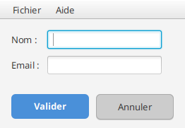

L'interface est décomposée en **trois zones** dans un `BorderPane` :


### Découverte du code

1. Ouvrez le fichier de l'exercice :
   ```
   src/main/java/fr/univ_amu/iut/exercice4/MiseEnPage.java
   ```

2. La méthode `start(Stage)` contient un TODO qui décrit la stratégie de construction : BorderPane comme racine, MenuBar en top, GridPane au center, HBox en bottom.

3. Ouvrez le fichier de test :
   ```
   src/test/java/fr/univ_amu/iut/exercice4/MiseEnPageTest.java
   ```

4. Cet exercice contient **11 tests** découpés en petits pas. Chaque test vous fait ajouter un seul élément à l'interface. Les commentaires dans le fichier de test indiquent l'étape correspondante.

### Travail à faire

Créez votre branche :

```bash
git checkout main
git checkout -b exercice4
```

Appliquez la [boucle de travail](#boucle-de-travail-pour-chaque-test) : activez et implémentez les tests **un par un**, dans l'ordre :

1. **`laFenetreEstVisible`** : appelez `show()`.
2. **`leRootEstUnBorderPane`** : créez un `BorderPane`, une `Scene`, et attachez-la au Stage avec `setScene()`.
3. **`leMenuBarEstEnHaut`** : créez un `MenuBar` et placez-le dans `borderPane.setTop()`.
4. **`leMenuBarContientDeuxMenus`** : ajoutez deux `Menu` au MenuBar avec `menuBar.getMenus().addAll(...)`.
5. **`lesMenusOntLesBonsNoms`** : les menus doivent s'appeler exactement `"Fichier"` et `"Aide"`.
6. **`leGridPaneEstAuCentre`** : créez un `GridPane` et placez-le dans `borderPane.setCenter()`.
7. **`lesLabelsNomEtEmailExistent`** : ajoutez deux `Label` ("Nom :" et "Email :") dans le GridPane avec `gridPane.add(label, colonne, ligne)`.
8. **`lesDeuxChampsDeSaisieExistent`** : ajoutez deux `TextField` dans le GridPane (colonne 1, lignes 0 et 1).
9. **`leHBoxEstEnBas`** : créez un `HBox` et placez-le dans `borderPane.setBottom()`.
10. **`leBoutonValiderExiste`** : ajoutez un `Button` "Valider" dans le HBox.
11. **`leBoutonAnnulerExiste`** : ajoutez un `Button` "Annuler" dans le HBox.
12. **Style (pour coller à la maquette, non testé)** : aérez le `GridPane` (`setHgap(10)`, `setVgap(10)`, un padding) et le `HBox` (espacement + padding). Les deux boutons ont la **même taille** (même padding + `setPrefWidth(110)`) : "Valider" est le **bouton primaire bleu** (`-fx-background-color: #4a90d9; -fx-text-fill: white; -fx-font-weight: bold;`) et "Annuler" le **bouton secondaire gris et plat** (`-fx-background-color: #cccccc; -fx-text-fill: #333333; -fx-border-color: #aaaaaa;`).

> [!TIP]
> Pour voir votre fenêtre dans le navigateur, utilisez le VNC comme expliqué dans l'[exercice 1](#voir-votre-fenêtre-avec-vnc).

### Finaliser l'exercice

Quand les 11 tests sont verts :

```bash
git add .
git commit -m "Exercice 4 terminé"
git push -u origin exercice4
gh pr create --title "Exercice 4 terminé" --body "Les 11 tests passent."
gh pr view --web
```

Consultez la PR, puis mergez :

```bash
gh pr merge --rebase --delete-branch
```

Vérifiez votre score sur l'onglet **Actions**.

> [!TIP]
> Si vous ne savez plus où vous en êtes, demandez à Copilot Chat : `Quelle est la prochaine étape ?`

---

## Exercice 5 - Réagir à un clic

**Objectif** : découvrir comment un composant JavaFX **réagit** à une action utilisateur. Vous allez brancher un écouteur sur un [`Button`](https://openjfx.io/javadoc/25/javafx.controls/javafx/scene/control/Button.html) et constater qu'un clic peut modifier l'état de l'application (ici, un compteur).

**Ce que vous allez découvrir** :
- [`EventHandler`](https://openjfx.io/javadoc/25/javafx.base/javafx/event/EventHandler.html) : l'interface fonctionnelle qui définit la réaction à un événement
- [`Button.setOnAction()`](https://openjfx.io/javadoc/25/javafx.controls/javafx/scene/control/ButtonBase.html#setOnAction(javafx.event.EventHandler)) : la méthode qui branche un écouteur sur un bouton
- Trois styles d'écriture pour un même écouteur : classe nommée, classe anonyme, lambda

### Maquette de l'IHM attendue


**Le rendu final** (votre objectif une fois l'exercice terminé, à comparer avec la maquette ci-dessus) :

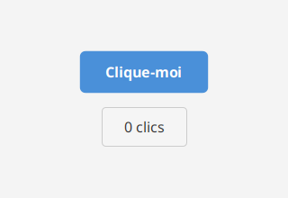

L'interface est simple : un bouton "Clique-moi" et un label qui affiche le nombre de clics. Le tout est empilé verticalement dans un `VBox`.

### Le graphe de scène


### Comment fonctionne un événement

Ce mécanisme s'appelle le **pattern Observer** (vu en [CM1 (slide 51)](https://iutinfoaix-r202.github.io/cours/cm1-fondations-ihm.html#51)) : le bouton (l'observable) ne sait pas ce que fera le handler (l'observateur). Il se contente de le notifier. C'est un principe fondamental de **séparation des préoccupations** : chaque composant a une seule responsabilité.

Quand l'utilisateur clique sur le bouton, JavaFX déclenche une chaîne d'appels :

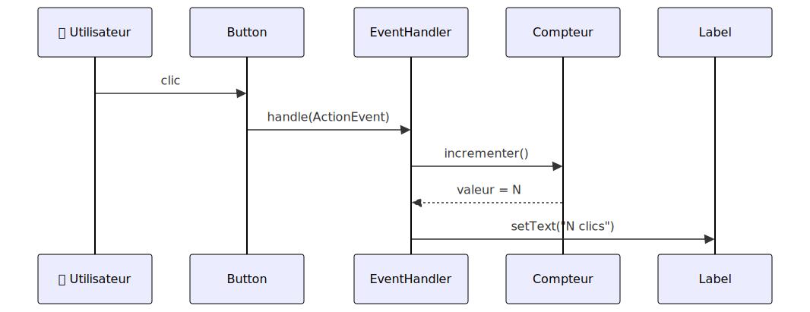

La méthode `setOnAction()` du bouton enregistre un `EventHandler` : c'est l'objet qui sera appelé à chaque clic. À l'intérieur de `handle()`, on incrémente le compteur puis on met à jour le texte du label.

### Structure de l'exercice

Cet exercice contient **trois fichiers Java** :

```
exercice5/
├── Compteur.java              ← fourni, ne pas modifier
├── EcouteurClasseNommee.java  ← vous implémentez handle()
└── EvenementsBouton.java      ← vous construisez l'IHM et branchez l'écouteur
```

La classe `Compteur` est un simple compteur avec `getValeur()` et `incrementer()`. Elle est entièrement fournie.

### Trois styles d'écouteur, tous équivalents

En Java, quand on veut réagir à un événement (un clic, une frappe clavier...), on passe un objet qui implémente l'interface [`EventHandler<ActionEvent>`](https://openjfx.io/javadoc/25/javafx.base/javafx/event/EventHandler.html). JavaFX accepte **trois écritures différentes** pour définir cet objet. Elles produisent le même résultat, mais n'ont pas la même verbosité.

Le starter code de [`EvenementsBouton.java`](src/main/java/fr/univ_amu/iut/exercice5/EvenementsBouton.java) montre les trois styles en commentaires. Vous en activez un, vous vérifiez que ça marche, puis vous pouvez essayer les autres pour les comparer.

**Style 1 - classe nommée** (style historique, avant Java 8) :
```java
bouton.setOnAction(new EcouteurClasseNommee(compteur));
```
L'écouteur est dans son propre fichier `.java`. Le plus verbeux, mais aussi le plus explicite : on voit clairement que le comportement est encapsulé dans une classe dédiée.

**Style 2 - classe anonyme** (intermédiaire) :
```java
bouton.setOnAction(new EventHandler<ActionEvent>() {
    @Override
    public void handle(ActionEvent e) {
        compteur.incrementer();
        labelCompteur.setText(compteur.getValeur() + " clics");
    }
});
```
On définit la classe directement sur place, sans lui donner de nom. Plus compact que le style 1, mais la syntaxe reste lourde.

**Style 3 - lambda** (moderne, recommandé depuis Java 8) :
```java
bouton.setOnAction(e -> {
    compteur.incrementer();
    labelCompteur.setText(compteur.getValeur() + " clics");
});
```
La syntaxe la plus compacte, celle que l'on rencontre le plus souvent dans du code JavaFX moderne. `EventHandler` étant une **interface fonctionnelle** (une seule méthode abstraite), le compilateur déduit automatiquement le type.

> [!NOTE]
> Les trois styles sont strictement équivalents pour les tests. Le test d'intégration vérifie le résultat (le label affiche le bon texte), pas la manière dont l'écouteur est écrit.

### Découverte du code

1. Ouvrez le fichier de la classe nommée :
   ```
   src/main/java/fr/univ_amu/iut/exercice5/EcouteurClasseNommee.java
   ```

2. Cette classe implémente `EventHandler<ActionEvent>` et reçoit un `Compteur` dans son constructeur. La méthode `handle()` contient un TODO : il suffit d'appeler `compteur.incrementer()`.

3. Ouvrez le fichier principal de l'exercice :
   ```
   src/main/java/fr/univ_amu/iut/exercice5/EvenementsBouton.java
   ```

4. La méthode `start(Stage)` contient un TODO avec les trois styles en commentaire. L'IHM attendue : un `Button` "Clique-moi" (id `bouton-clique-moi`), un `Label` "0 clics" (id `compteur`), le tout dans un `VBox`.

5. Ouvrez les fichiers de test :
   ```
   src/test/java/fr/univ_amu/iut/exercice5/EcouteurClasseNommeeTest.java
   src/test/java/fr/univ_amu/iut/exercice5/EvenementsBoutonTest.java
   ```

6. Cet exercice contient **7 tests** dans deux fichiers séparés :

   **`EcouteurClasseNommeeTest`** (1 test unitaire, pas de TestFX) :
   - `handleIncrementeLeCompteur` : vérifie que `handle()` appelle bien `compteur.incrementer()` à chaque invocation

   **`EvenementsBoutonTest`** (6 tests d'intégration, TestFX) :
   - `laFenetreEstVisible` : le Stage doit être affiché
   - `laSceneExiste` : le Stage doit avoir une Scene attachée
   - `leBoutonExiste` : un Button avec l'id `bouton-clique-moi` doit être présent
   - `leBoutonAfficheLeBonTexte` : le bouton doit afficher "Clique-moi"
   - `leLabelCompteurExiste` : un Label avec l'id `compteur` doit être présent
   - `troisClicsAffichent3Clics` : 3 clics sur le bouton → le label affiche "3 clics"

### Travail à faire

Créez votre branche :

```bash
git checkout main
git checkout -b exercice5
```

Appliquez la [boucle de travail](#boucle-de-travail-pour-chaque-test) : activez et implémentez les tests **un par un**, dans l'ordre :

1. **`handleIncrementeLeCompteur`** (dans `EcouteurClasseNommeeTest`) : ouvrez `EcouteurClasseNommee.java` et implémentez le TODO dans `handle()`. Une seule ligne suffit : appelez `compteur.incrementer()`.
2. **`laFenetreEstVisible`** (dans `EvenementsBoutonTest`) : ouvrez `EvenementsBouton.java`. Pour l'instant, ajoutez simplement `primaryStage.show()` à la fin de `start()`.
3. **`laSceneExiste`** : créez un conteneur (par exemple un [`VBox`](https://openjfx.io/javadoc/25/javafx.graphics/javafx/scene/layout/VBox.html)), une `Scene`, et attachez-la au Stage avec `setScene()`.
4. **`leBoutonExiste`** : créez un `Button` et ajoutez-le au `VBox`. Donnez-lui l'id `bouton-clique-moi` avec `bouton.setId("bouton-clique-moi")`.
5. **`leBoutonAfficheLeBonTexte`** : passez le texte `"Clique-moi"` au constructeur du Button, ou utilisez `setText()`.
6. **`leLabelCompteurExiste`** : créez un `Label` avec l'id `compteur` et ajoutez-le au VBox.
7. **`troisClicsAffichent3Clics`** : c'est ici que vous branchez l'écouteur. Créez un `Compteur`, puis utilisez `bouton.setOnAction(...)` pour incrémenter le compteur et mettre à jour le texte du label à chaque clic. Choisissez le style d'écouteur de votre choix (voir les 3 styles ci-dessus).
8. **Style (pour coller à la maquette, non testé)** : centrez le contenu (`root.setAlignment(Pos.CENTER)`), donnez au bouton un **fond bleu + texte blanc gras** (`setStyle("-fx-background-color: #4a90d9; -fx-text-fill: white; -fx-font-weight: bold; -fx-padding: 12 28;")`) et **encadrez** le label (fond clair + bordure).

> [!TIP]
> Commencez par le style lambda (style 3) : c'est le plus rapide à écrire. Quand le test passe, essayez de remplacer par le style 1 ou 2 pour voir la différence de syntaxe - le test doit toujours passer.

> [!TIP]
> Pour voir votre fenêtre dans le navigateur, utilisez le VNC comme expliqué dans l'[exercice 1](#voir-votre-fenêtre-avec-vnc).

### Finaliser l'exercice

Quand les 7 tests sont verts :

```bash
git add .
git commit -m "Exercice 5 terminé"
git push -u origin exercice5
gh pr create --title "Exercice 5 terminé" --body "Les 7 tests passent."
gh pr view --web
```

Consultez la PR, puis mergez :

```bash
gh pr merge --rebase --delete-branch
```

Vérifiez votre score sur l'onglet **Actions**. Il devrait avoir augmenté.

> [!TIP]
> Si vous ne savez plus où vous en êtes, demandez à Copilot Chat : `Quelle est la prochaine étape ?`

---

## Exercice 6 - Palette de couleurs (capstone)

**Objectif** : **synthèse** - cet exercice mobilise l'ensemble des concepts vus jusqu'ici (layouts, composants, événements, mise à jour de labels) dans une petite application autonome. C'est le dernier exercice du TP. Il illustre aussi l'heuristique de [Nielsen #1](https://iutinfoaix-r202.github.io/cours/cm1-fondations-ihm.html#18) (**visibilité de l'état du système**) : chaque clic produit un feedback immédiat (la couleur change, le compteur se met à jour).

**Ce que vous allez mobiliser** :
- [`BorderPane`](https://openjfx.io/javadoc/25/javafx.graphics/javafx/scene/layout/BorderPane.html) et [`HBox`](https://openjfx.io/javadoc/25/javafx.graphics/javafx/scene/layout/HBox.html) pour la mise en page
- [`Button`](https://openjfx.io/javadoc/25/javafx.controls/javafx/scene/control/Button.html) et [`Pane`](https://openjfx.io/javadoc/25/javafx.graphics/javafx/scene/layout/Pane.html) pour l'interaction
- `setOnAction()` et `setStyle()` pour le comportement dynamique

### Maquette de l'IHM attendue


**Le rendu final** (votre objectif une fois l'exercice terminé, à comparer avec la maquette ci-dessus) :

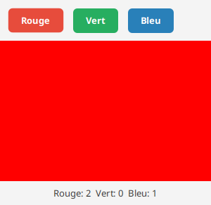

- Cliquer **Rouge** → le fond du `Pane` central devient rouge, et le compteur Rouge du label augmente de 1
- Même principe pour Vert et Bleu
- Les 3 compteurs sont **indépendants** : cliquer Rouge n'affecte pas les compteurs Vert et Bleu

### Le graphe de scène

L'interface est décomposée en **trois zones** dans un `BorderPane`, comme dans l'exercice 4 :


### Découverte du code

1. Ouvrez le fichier de l'exercice :
   ```
   src/main/java/fr/univ_amu/iut/exercice6/Palette.java
   ```

2. La méthode `start(Stage)` contient un TODO qui décrit la stratégie de construction en 6 points : BorderPane, HBox avec 3 boutons, Pane central, Label compteurs, 3 compteurs entiers, écouteurs pour chaque bouton.

3. Ouvrez le fichier de test :
   ```
   src/test/java/fr/univ_amu/iut/exercice6/PaletteTest.java
   ```

4. Cet exercice contient **10 tests** découpés en étapes progressives :
   - `laFenetreEstVisible` : le Stage doit être affiché
   - `laSceneExiste` : le Stage doit avoir une Scene attachée
   - `lesTroisBoutonsExistent` : 3 boutons avec les ids `btn-rouge`, `btn-vert`, `btn-bleu`
   - `laZoneDeCouleurExiste` : un Pane avec l'id `zone`
   - `leLabelCompteursExiste` : un Label avec l'id `compteurs`
   - `cliquerRougeMetLaZoneEnRouge` : le style du Pane contient `red` après un clic
   - `cliquerVertMetLaZoneEnVert` : le style du Pane contient `green` après un clic
   - `cliquerBleuMetLaZoneEnBleu` : le style du Pane contient `blue` après un clic
   - `cliquerIncrementeLeCompteurCorrespondant` : 2 clics sur Vert → label contient `Vert: 2`
   - `lesCompteursSontIndependants` : 2×Rouge + 1×Bleu → `Rouge: 2`, `Vert: 0`, `Bleu: 1`

### Ids attendus

| Composant | Id |
|---|---|
| Bouton rouge | `btn-rouge` |
| Bouton vert | `btn-vert` |
| Bouton bleu | `btn-bleu` |
| Zone de couleur (Pane) | `zone` |
| Label des compteurs | `compteurs` |

Attribuez les ids avec `setId("...")` sur chaque composant. Les tests les retrouvent via `robot.lookup("#btn-rouge")`, etc.

### Travail à faire

Créez votre branche :

```bash
git checkout main
git checkout -b exercice6
```

Appliquez la [boucle de travail](#boucle-de-travail-pour-chaque-test) : activez et implémentez les tests **un par un**, dans l'ordre :

1. **`laFenetreEstVisible`** : appelez `show()` sur le Stage.
2. **`laSceneExiste`** : créez un `BorderPane`, une `Scene`, et attachez-la au Stage.
3. **`lesTroisBoutonsExistent`** : créez 3 `Button` ("Rouge", "Vert", "Bleu") avec les ids `btn-rouge`, `btn-vert`, `btn-bleu`. Placez-les dans un `HBox` (avec un peu d'espacement et de padding) et assignez le HBox à `borderPane.setTop()`. Pour coller à la maquette, **colorez chaque bouton** avec sa couleur de fond, un texte blanc et des coins arrondis : `btnRouge.setStyle("-fx-background-color: #e74c3c; -fx-text-fill: white; -fx-font-weight: bold; -fx-background-radius: 6;")` (idem `#27ae60` pour Vert, `#2980b9` pour Bleu).
4. **`laZoneDeCouleurExiste`** : créez un `Pane` avec l'id `zone` et placez-le au centre du BorderPane avec `setCenter()`. Donnez-lui une taille minimale avec `zone.setMinSize(300, 200)`.
5. **`leLabelCompteursExiste`** : créez un `Label` avec l'id `compteurs` et le texte initial `"Rouge: 0  Vert: 0  Bleu: 0"`. Placez-le dans `borderPane.setBottom()`. Pour qu'il s'affiche **centré comme une barre de statut** (cf. maquette), donnez-lui `setMaxWidth(Double.MAX_VALUE)` + `setAlignment(Pos.CENTER)`.
6. **`cliquerRougeMetLaZoneEnRouge`** : branchez un écouteur sur le bouton Rouge qui change le style de la zone avec `zone.setStyle("-fx-background-color: red;")`.
7. **`cliquerVertMetLaZoneEnVert`** : même principe pour le bouton Vert avec `green`.
8. **`cliquerBleuMetLaZoneEnBleu`** : même principe pour le bouton Bleu avec `blue`.
9. **`cliquerIncrementeLeCompteurCorrespondant`** : ajoutez 3 variables entières (`compteurRouge`, `compteurVert`, `compteurBleu`). Dans chaque écouteur, incrémentez le bon compteur et mettez à jour le texte du label avec le format `"Rouge: N  Vert: N  Bleu: N"`.
10. **`lesCompteursSontIndependants`** : si vos compteurs sont bien séparés, ce test devrait passer sans modification supplémentaire.

> [!NOTE]
> Le format du texte du label est libre tant qu'il contient les sous-chaînes `Rouge: N`, `Vert: N` et `Bleu: N` (avec un espace après les deux-points). Le séparateur entre les trois est à votre choix (espaces, tirets, virgules...).

> [!TIP]
> Pour voir votre fenêtre dans le navigateur, utilisez le VNC comme expliqué dans l'[exercice 1](#voir-votre-fenêtre-avec-vnc).

### Finaliser l'exercice

Quand les 10 tests sont verts :

```bash
git add .
git commit -m "Exercice 6 terminé"
git push -u origin exercice6
gh pr create --title "Exercice 6 terminé" --body "Les 10 tests passent. TP1 terminé."
gh pr view --web
```

Consultez la PR, puis mergez :

```bash
gh pr merge --rebase --delete-branch
```

Vérifiez votre score sur l'onglet **Actions**. Si tous les exercices sont terminés, votre score devrait être de **1000/1000** (soit 20/20 une fois ramené sur 20). Bravo, le TP1 est terminé !

---

## Exercices bonus

> [!NOTE]
> Les exercices bonus **ne comptent pas dans la note**. Ils sont là pour celles et ceux qui terminent les 6 exercices en avance et souhaitent explorer des concepts plus avancés. Les tests fonctionnent exactement comme ceux des exercices principaux (baby steps, `@Disabled` à retirer). Le workflow Git (branche → PR → merge) reste le même.

## Bonus 7 - Balle rebondissante

**Objectif** : découvrir les **animations** JavaFX. Une balle rebondit verticalement dans un panneau. Quatre boutons contrôlent l'animation, et un slider ajuste la vitesse en temps réel.

**Ce que vous allez découvrir** :
- [`TranslateTransition`](https://openjfx.io/javadoc/25/javafx.graphics/javafx/animation/TranslateTransition.html) : une animation qui déplace un noeud le long d'un axe
- [`Animation`](https://openjfx.io/javadoc/25/javafx.graphics/javafx/animation/Animation.html) : `playFromStart()`, `pause()`, `play()`, `stop()` pour contrôler une animation
- `autoReverse` et `cycleCount(INDEFINITE)` : faire rebondir indéfiniment
- [`Slider`](https://openjfx.io/javadoc/25/javafx.controls/javafx/scene/control/Slider.html) : un curseur linéaire avec `valueProperty()` pour écouter les changements de valeur

### Maquette de l'IHM attendue


**Le rendu final** (votre objectif une fois l'exercice terminé, à comparer avec la maquette ci-dessus) :

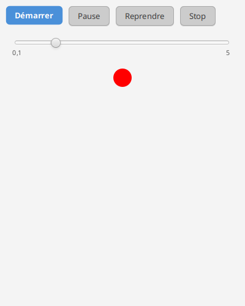

L'interface se décompose verticalement dans un `VBox` :
- En haut : un `HBox` avec 4 boutons de contrôle
- Au milieu : un `Slider` de vitesse (0.1x à 5x)
- En bas : un `Pane` contenant un `Circle` rouge qui rebondit entre `fromY=10` et `toY=400`

### Comment fonctionne une animation JavaFX

Une [`TranslateTransition`](https://openjfx.io/javadoc/25/javafx.graphics/javafx/animation/TranslateTransition.html) déplace un noeud (ici le cercle) en modifiant sa propriété `translateY` au fil du temps :

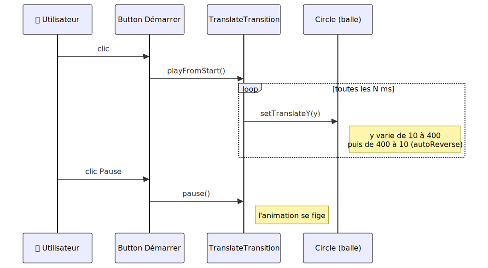

La propriété `rate` de la transition contrôle la vitesse : `rate=1` est la vitesse normale, `rate=2` est deux fois plus rapide, `rate=0.5` deux fois plus lent. Le slider ajuste cette propriété en temps réel.

**Créer une animation en 5 lignes** :

```java
TranslateTransition transition = new TranslateTransition(Duration.millis(1000), cercle);
transition.setFromY(10);        // position de départ
transition.setToY(400);         // position d'arrivée
transition.setAutoReverse(true); // revient en arrière automatiquement
transition.setCycleCount(Animation.INDEFINITE); // boucle infinie
```

Pour la lancer : `transition.playFromStart()`. Pour la contrôler : `pause()`, `play()` (reprend), `stop()`.

**Écouter les changements du Slider** :

Dans les exercices précédents, vous avez utilisé `setOnAction()` pour réagir à un clic sur un bouton. Pour un `Slider`, c'est différent : la valeur change en continu quand l'utilisateur fait glisser le curseur. On écoute la **propriété** `value` via un listener :

```java
slider.valueProperty().addListener((observable, ancienneValeur, nouvelleValeur) -> {
    transition.setRate(nouvelleValeur.doubleValue());
});
```

Ce code est exécuté à chaque fois que la valeur du slider change. `nouvelleValeur` est un `Number` qu'on convertit en `double` avec `doubleValue()`.

### Le graphe de scène


### Découverte du code

1. Ouvrez le fichier de l'exercice :
   ```
   src/main/java/fr/univ_amu/iut/bonus7/BalleRebondissante.java
   ```

2. La méthode `start(Stage)` contient un TODO en 6 étapes : créer le VBox, le HBox avec 4 boutons, le Slider, le Circle, le Pane, et la TranslateTransition.

3. Ouvrez le fichier de test :
   ```
   src/test/java/fr/univ_amu/iut/bonus7/BalleRebondissanteTest.java
   ```

4. Cet exercice contient **14 tests** découpés en étapes progressives :
   - `laFenetreEstVisible` : le Stage doit être affiché
   - `laSceneExiste` : le Stage doit avoir une Scene attachée
   - `leBoutonDemarrerExiste` : un Button avec l'id `btn-start`
   - `leBoutonPauseExiste` : un Button avec l'id `btn-pause`
   - `leBoutonReprendreExiste` : un Button avec l'id `btn-resume`
   - `leBoutonStopExiste` : un Button avec l'id `btn-stop`
   - `leSliderExiste` : un Slider avec l'id `slider-vitesse`
   - `leSliderALesBonnesLimites` : min=0.1, max=5.0
   - `laBalleExiste` : un Circle avec l'id `balle`, rayon 15
   - `laZoneAnimationExiste` : un Pane avec l'id `zone-animation`
   - `demarrerLanceAnimation` : après clic sur Démarrer, la balle bouge
   - `pauseArreteLAnimation` : après Pause, la balle se fige
   - `reprendreContinueLAnimation` : après Reprendre, la balle rebouge
   - `stopArreteLAnimation` : après Stop, la balle se fige

### Ids attendus

| Composant | Id |
|---|---|
| Bouton Démarrer | `btn-start` |
| Bouton Pause | `btn-pause` |
| Bouton Reprendre | `btn-resume` |
| Bouton Stop | `btn-stop` |
| Slider de vitesse | `slider-vitesse` |
| Balle (Circle) | `balle` |
| Zone d'animation (Pane) | `zone-animation` |

### Travail à faire

Créez votre branche :

```bash
git checkout main
git checkout -b bonus7
```

Appliquez la [boucle de travail](#boucle-de-travail-pour-chaque-test) : activez et implémentez les tests **un par un**, dans l'ordre :

1. **`laFenetreEstVisible`** : appelez `show()`.
2. **`laSceneExiste`** : créez un `VBox`, une `Scene`, et attachez-la au Stage.
3. **`leBoutonDemarrerExiste`** : créez un `Button` "Démarrer" avec l'id `btn-start`. Placez-le dans un `HBox`, ajoutez le HBox au VBox. Pour coller à la maquette, c'est le bouton primaire **bleu** : `btnStart.setStyle("-fx-background-color: #4a90d9; -fx-text-fill: white; -fx-font-weight: bold;")`.
4. **`leBoutonPauseExiste`** : ajoutez un Button "Pause" (id `btn-pause`) au HBox.
5. **`leBoutonReprendreExiste`** : ajoutez un Button "Reprendre" (id `btn-resume`) au HBox.
6. **`leBoutonStopExiste`** : ajoutez un Button "Stop" (id `btn-stop`) au HBox. Pour coller à la maquette, **Pause, Reprendre et Stop partagent un même style secondaire gris et plat** (`-fx-background-color: #cccccc; -fx-text-fill: #333333; -fx-border-color: #aaaaaa; -fx-background-radius: 6;`), arrondi comme « Démarrer ».
7. **`leSliderExiste`** : créez un [`Slider`](https://openjfx.io/javadoc/25/javafx.controls/javafx/scene/control/Slider.html) avec l'id `slider-vitesse` et ajoutez-le au VBox.
8. **`leSliderALesBonnesLimites`** : configurez le slider avec `new Slider(0.1, 5, 1)` (min, max, valeur initiale). Pour coller à la maquette, **affichez ses bornes** : `setShowTickLabels(true)`, `setShowTickMarks(true)`, `setMajorTickUnit(4.9)` et `setMinorTickCount(0)` (un pas égal à la plage ne marque que le min et le max).
9. **`laBalleExiste`** : créez un `Circle` de rayon 15, couleur rouge, avec l'id `balle`. Placez-le dans un `Pane` (id `zone-animation`) et ajoutez le Pane au VBox. Pour coller à la maquette, **centrez la balle horizontalement** : `balle.layoutXProperty().bind(pane.widthProperty().divide(2))`.
10. **`laZoneAnimationExiste`** : si vous avez suivi l'étape précédente, ce test devrait déjà passer.
11. **`demarrerLanceAnimation`** : créez une [`TranslateTransition`](https://openjfx.io/javadoc/25/javafx.graphics/javafx/animation/TranslateTransition.html) de 1000ms sur le cercle, avec `fromY=10`, `toY=400`, `autoReverse=true`, `cycleCount=INDEFINITE`. Branchez le bouton Démarrer sur `transition.playFromStart()`.
12. **`pauseArreteLAnimation`** : branchez le bouton Pause sur `transition.pause()`.
13. **`reprendreContinueLAnimation`** : branchez le bouton Reprendre sur `transition.play()`.
14. **`stopArreteLAnimation`** : branchez le bouton Stop sur `transition.stop()`. Ajoutez aussi un listener sur le slider : `slider.valueProperty().addListener((obs, old, val) -> transition.setRate(val.doubleValue()))`.

> [!TIP]
> Pour voir l'animation dans le navigateur, utilisez le VNC comme expliqué dans l'[exercice 1](#voir-votre-fenêtre-avec-vnc). L'effet visuel est beaucoup plus parlant qu'un simple test vert !

### Finaliser l'exercice

Quand les 14 tests sont verts :

```bash
git add .
git commit -m "Bonus 7 terminé"
git push -u origin bonus7
gh pr create --title "Bonus 7 terminé" --body "Les 14 tests passent."
gh pr view --web
```

Consultez la PR, puis mergez :

```bash
gh pr merge --rebase --delete-branch
```

---

## Bonus 8 - Mini-jeu Pacman

**Objectif** : **synthèse avancée** mêlant héritage, composition graphique, événements clavier et détection de collision. Un Pacman et un Fantôme se déplacent sur un plateau de jeu, chacun contrôlé par un joueur différent.

**Ce que vous allez découvrir** :
- [`Group`](https://openjfx.io/javadoc/25/javafx.graphics/javafx/scene/Group.html) : composer un personnage à partir de plusieurs formes (`Circle`, `Rectangle`, `Line`)
- [`KeyEvent`](https://openjfx.io/javadoc/25/javafx.graphics/javafx/scene/input/KeyEvent.html) et `setOnKeyPressed()` : réagir aux touches du clavier
- Détection de collision avec `getBoundsInParent()`
- Héritage et polymorphisme : `Pacman` et `Fantome` héritent de `Personnage`

### Maquette du jeu


**Le rendu final** (votre objectif une fois l'exercice terminé, à comparer avec la maquette ci-dessus) :

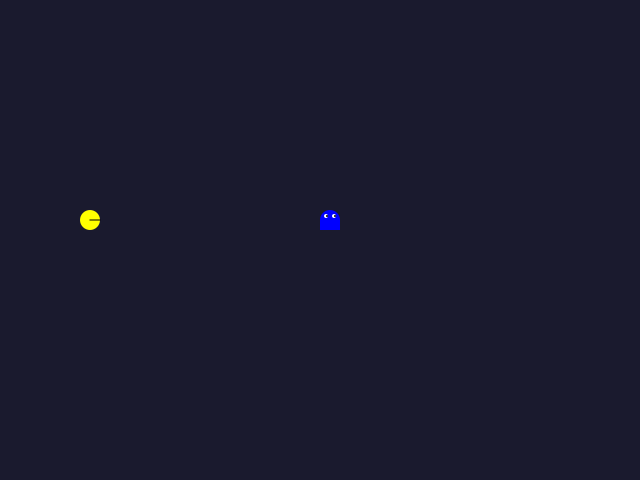

Le plateau de jeu est un `Pane` de 640x480 pixels, au **fond bleu nuit** (`-fx-background-color: #1a1a2e`, comme sur la maquette). Les personnages se déplacent sur une grille invisible de 20x20 pixels. Le Pacman est contrôlé par les **flèches directionnelles**, le Fantôme par les touches **Z/Q/S/D**.

### Le graphe de scène


Chaque personnage est un `Group` qui contient ses formes géométriques. Le `Pane` sert de plateau de jeu, et la `Scene` capture les événements clavier via `setOnKeyPressed()`.

### Architecture des classes

L'exercice utilise l'**héritage** : `Pacman` et `Fantome` héritent de `Personnage`, qui hérite lui-même de `Group`.

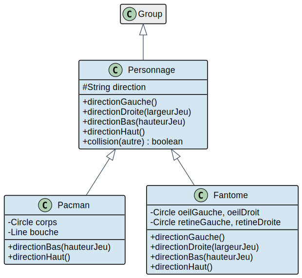

### Ce qui est fourni vs ce qui est à compléter

| Classe | Fourni | À compléter |
|---|---|---|
| `Personnage` | `directionGauche()`, `directionDroite()`, `collision()` | `directionBas()`, `directionHaut()` |
| `Pacman` | Constructeur, `directionGauche()`, `directionDroite()` | `directionBas()` (bouche vers le bas), `directionHaut()` (bouche vers le haut) |
| `Fantome` | Constructeur (corps + yeux) | Les 4 directions (appeler `super` + orienter les rétines) |
| `JeuPacman` | Tout (assemblage + clavier) | Rien |

### Comment fonctionne le déplacement avec héritage

Chaque méthode de direction fait **deux choses** : déplacer le personnage, puis ajuster son apparence visuelle (orientation de la bouche ou des yeux). L'héritage permet de séparer ces responsabilités :

1. **`Personnage`** (la classe parent) gère le **déplacement** : vérifier les limites du plateau, modifier `layoutX`/`layoutY`, et mettre à jour la direction courante.
2. **`Pacman`** ou **`Fantome`** (les classes enfant) appellent `super.directionXxx()` pour déléguer le déplacement au parent, puis ajustent leur **apparence** (bouche ou yeux).

Par exemple, voici comment `Pacman.directionDroite()` est implémenté (ce code est fourni, il sert de modèle pour les TODO) :

```java
@Override
public void directionDroite(double largeurJeu) {
    super.directionDroite(largeurJeu);  // 1. délègue le déplacement au parent
    // 2. oriente la bouche vers la droite
    bouche.setEndX(bouche.getStartX() + LARGEUR_MOITIE_PERSONNAGE);
    bouche.setEndY(bouche.getStartY());
}
```

Pour implémenter `directionBas()`, le principe est le même : appeler `super.directionBas(hauteurJeu)`, puis ajuster les coordonnées de la bouche pour qu'elle pointe vers le bas (modifier `endY` au lieu de `endX`).

Pour le Fantôme, le principe est identique mais au lieu d'orienter une bouche, on déplace les **rétines** (petits cercles noirs) à l'intérieur des yeux (cercles blancs). Par exemple, pour regarder à gauche : `retineGauche.setCenterX(oeilGauche.getCenterX() - 1)`.

### Découverte du code

1. Commencez par `Personnage.java` :
   ```
   src/main/java/fr/univ_amu/iut/bonus8/Personnage.java
   ```
   Cette classe fournit `directionGauche()` et `directionDroite()` qui déplacent le personnage de 20 pixels et mettent à jour la direction. Les méthodes `directionBas()` et `directionHaut()` contiennent des TODO : même logique mais sur l'axe Y.

2. Ouvrez `Pacman.java` :
   ```
   src/main/java/fr/univ_amu/iut/bonus8/Pacman.java
   ```
   Le Pacman est un cercle jaune avec une bouche (un trait). Les méthodes `directionGauche()` et `directionDroite()` sont implémentées : elles appellent `super` puis orientent la bouche. Les TODO sont dans `directionBas()` et `directionHaut()` : appeler `super` puis ajuster `bouche.setEndX/setEndY`.

3. Ouvrez `Fantome.java` :
   ```
   src/main/java/fr/univ_amu/iut/bonus8/Fantome.java
   ```
   Le Fantôme est un cercle bleu avec un rectangle et deux yeux (cercles blancs + rétines noires). Les 4 méthodes de direction contiennent des TODO : appeler `super` puis positionner les rétines dans la direction du regard.

4. Ouvrez `JeuPacman.java` :
   ```
   src/main/java/fr/univ_amu/iut/bonus8/JeuPacman.java
   ```
   Ce fichier est entièrement fourni. Il crée le plateau, place les personnages, et branche les événements clavier.

5. Ouvrez les fichiers de test :
   ```
   src/test/java/fr/univ_amu/iut/bonus8/PersonnageTest.java
   src/test/java/fr/univ_amu/iut/bonus8/JeuPacmanTest.java
   ```

6. Cet exercice contient **16 tests** dans deux fichiers :

   **`PersonnageTest`** (12 tests unitaires) :
   - Déplacement : `directionBasDeplace`, `directionHautDeplace`, limites haut/bas
   - Bouche Pacman : `pacmanBouchePointeVersLeBas`, `pacmanBouchePointeVersLeHaut`
   - Yeux Fantôme : `fantomeYeuxVersLaGauche`, `fantomeYeuxVersLaDroite`, `fantomeYeuxVersLeBas`, `fantomeYeuxVersLeHaut`
   - Collision : `collisionDetecteeQuandSuperposition`, `pasDeCollisionQuandEloignes`

   **`JeuPacmanTest`** (4 tests d'intégration) :
   - `laFenetreEstVisible`, `lePlateauExiste`, `lePacmanExiste`, `leFantomeExiste`

### Travail à faire

Créez votre branche :

```bash
git checkout main
git checkout -b bonus8
```

Appliquez la [boucle de travail](#boucle-de-travail-pour-chaque-test) en commençant par `PersonnageTest` (les fondations) puis `JeuPacmanTest` (l'assemblage) :

1. **`directionBasDeplaceLePacmanVersLeBas`** : dans `Personnage.java`, implémentez `directionBas()`. Même logique que `directionDroite()` mais sur l'axe Y : vérifier que `layoutY < hauteurJeu - LARGEUR_PERSONNAGE`, puis `setLayoutY(getLayoutY() + LARGEUR_PERSONNAGE)`.
2. **`directionHautDeplaceLePacmanVersLeHaut`** : implémentez `directionHaut()`. Vérifier que `layoutY >= LARGEUR_PERSONNAGE`, puis reculer.
3. **`directionHautNeDepassePasLeBordSuperieur`** : devrait passer si votre `if` est correct.
4. **`directionBasNeDepassePasLeBordInferieur`** : idem.
5. **`pacmanBouchePointeVersLeBas`** : dans `Pacman.java`, implémentez `directionBas()`. Appelez `super.directionBas(hauteurJeu)` puis orientez la bouche vers le bas avec `bouche.setEndX(bouche.getStartX())` et `bouche.setEndY(bouche.getStartY() + LARGEUR_MOITIE_PERSONNAGE)`.
6. **`pacmanBouchePointeVersLeHaut`** : même principe avec `setEndY(bouche.getStartY() - LARGEUR_MOITIE_PERSONNAGE)`.
7. **`fantomeYeuxVersLaGauche`** : dans `Fantome.java`, implémentez `directionGauche()`. Appelez `super.directionGauche()` puis positionnez les rétines à gauche des yeux : `retine.setCenterX(oeil.getCenterX() - 1)`.
8. **`fantomeYeuxVersLaDroite`** : rétines à droite : `retine.setCenterX(oeil.getCenterX() + 1)`.
9. **`fantomeYeuxVersLeBas`** : rétines en bas : `retine.setCenterY(oeil.getCenterY() + 1)`.
10. **`fantomeYeuxVersLeHaut`** : rétines en haut : `retine.setCenterY(oeil.getCenterY() - 1)`.
11. **`collisionDetecteeQuandSuperposition`** : la méthode `collision()` est déjà fournie dans `Personnage`, ce test devrait passer.
12. **`pasDeCollisionQuandEloignes`** : idem.
13-16. **Tests `JeuPacmanTest`** : `JeuPacman.java` est entièrement fourni. Ces 4 tests devraient passer dès que les classes `Pacman` et `Fantome` compilent correctement.

> [!TIP]
> Pour tester le jeu visuellement, lancez-le via le VNC et jouez avec les flèches (Pacman) et Z/Q/S/D (Fantôme). Essayez de provoquer une collision !

### Finaliser l'exercice

Quand les 16 tests sont verts :

```bash
git add .
git commit -m "Bonus 8 terminé"
git push -u origin bonus8
gh pr create --title "Bonus 8 terminé" --body "Les 16 tests passent."
gh pr view --web
```

Consultez la PR, puis mergez :

```bash
gh pr merge --rebase --delete-branch
```

---

## Ressources complémentaires

- [JavaFX 25 API Documentation](https://openjfx.io/javadoc/25/) : la référence complète de toutes les classes JavaFX
- [OpenJFX - Getting Started](https://openjfx.io/openjfx-docs/) : guide officiel de démarrage
- [JavaFX CSS Reference](https://openjfx.io/javadoc/25/javafx.graphics/javafx/scene/doc-files/cssref.html) : toutes les propriétés CSS utilisables avec `setStyle()` (exercices 6 et bonus 7)
- [JavaFX Tutorial (code.makery)](https://code.makery.ch/library/javafx-tutorial/) : tutoriel progressif en français
- [Animation JavaFX](https://openjfx.io/javadoc/25/javafx.graphics/javafx/animation/package-summary.html) : classes d'animation (`TranslateTransition`, `Timeline`, etc.) pour le bonus 7
- [TestFX Documentation](https://github.com/TestFX/TestFX) : le framework de test utilisé dans ce TP

---

## Dépannage

**Le premier `./mvnw` prend plusieurs minutes** - c'est normal. Le wrapper télécharge Maven 3.9.14 puis toutes les dépendances JavaFX / JUnit / TestFX (~50 Mo au total). Les exécutions suivantes utilisent le cache local et sont quasi instantanées.

**`./mvnw: Permission denied`** - après certains clones, le bit exécutable peut être perdu. Corrigez avec :
```bash
chmod +x mvnw
```

**`java: command not found` ou version < 25** - ce problème ne devrait pas se produire dans un Codespace. En cas d'installation locale, voir ci-dessous.

**Tests TestFX qui plantent avec `No X11 DISPLAY`** (Linux sans serveur X actif) - lancez les tests via `xvfb-run` :
```bash
xvfb-run --auto-servernum ./mvnw test
```
Dans un Codespace, le display virtuel est déjà configuré et ce problème ne se produit pas.

**Sous Windows, `./mvnw ...` ne fonctionne pas** - utilisez `mvnw.cmd` à la place :
```powershell
.\mvnw.cmd javafx:run
```

**`Cannot resolve symbol` / import manquant** - si VS Code souligne une classe en rouge (par exemple `Scene`, `BorderPane`, `Label`), c'est qu'il manque l'import correspondant. Placez le curseur sur le mot souligné et appuyez sur `Ctrl+.` (point) pour voir les suggestions d'import. Choisissez toujours l'import qui commence par `javafx.` (pas `java.awt.` ni `javax.`).

**J'ai créé ma branche depuis la mauvaise branche** - si vous avez fait `git checkout -b exercice3` alors que vous étiez sur `exercice2` au lieu de `main`, pas de panique :
```bash
git checkout main
git branch -D exercice3           # supprime la branche locale
git checkout -b exercice3         # recrée depuis main
```

**Le port 6080 (VNC) n'apparaît pas dans l'onglet Ports** - le serveur VNC met quelques secondes à démarrer après l'ouverture du Codespace. Attendez 10 secondes puis rafraîchissez l'onglet Ports. Si le port n'apparaît toujours pas, ouvrez un terminal et lancez `./mvnw javafx:run` : le port devrait alors apparaître automatiquement.

**La fenêtre VNC est vide ou noire** - la fenêtre JavaFX s'ouvre peut-être derrière le bureau. Cliquez sur la barre des tâches dans le VNC (en bas) pour voir si une fenêtre est réduite. Vous pouvez aussi fermer l'application (`Ctrl+C` dans le terminal) et la relancer.

**Conflit lors du merge de la PR** - si GitHub affiche "This branch has conflicts", c'est probablement que vous avez modifié un fichier sur `main` directement. La solution la plus simple :
```bash
git checkout main
git pull
git checkout exerciceN
git rebase main
# résolvez les conflits si nécessaire, puis :
git push --force-with-lease
```
En cas de doute, demandez à Copilot Chat : `J'ai un conflit Git, comment le résoudre ?`

---

### 📦 Installation locale (facultative) - pour travailler en dehors du Codespace

**Sur les machines de l'IUT** (Linux, SDKMAN pré-installé) :

```bash
sdk install java 25.fx-zulu
```

**Chez vous sous Linux / macOS** - installez d'abord SDKMAN depuis [sdkman.io](https://sdkman.io), puis la commande ci-dessus.

**Windows** - via [Scoop](https://scoop.sh) :

```powershell
scoop bucket add java
scoop install java/zulu-jdk-fx25
```

Alternative Windows : installateur GUI sur [azul.com/downloads](https://www.azul.com/downloads/?package=jdk-fx&version=25).

**Vérifier l'installation** :

```bash
java -version
# doit afficher "openjdk version \"25.0.x\"" ou similaire
```

---

*IUT d'Aix-Marseille - Département Informatique - 2026*
